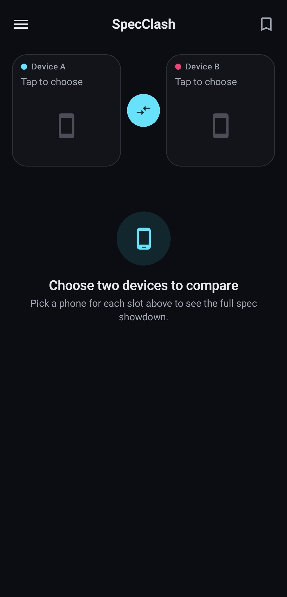
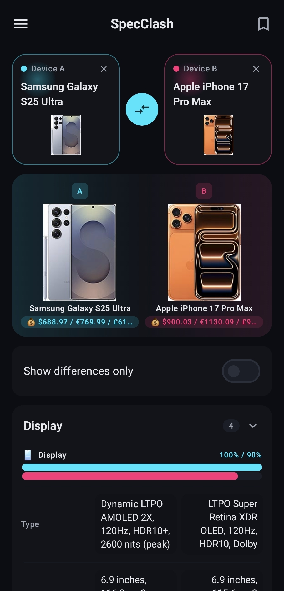
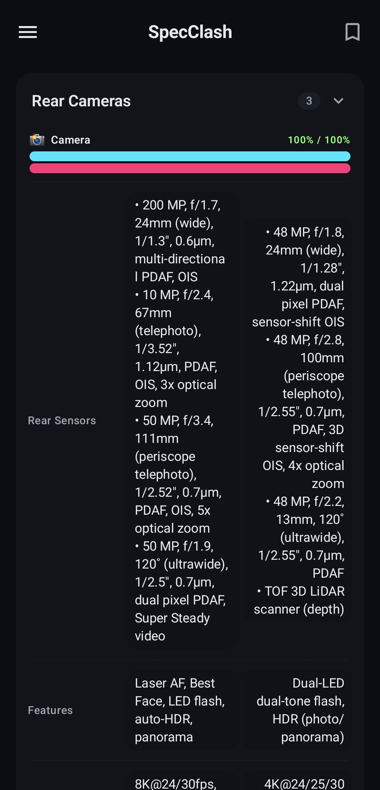
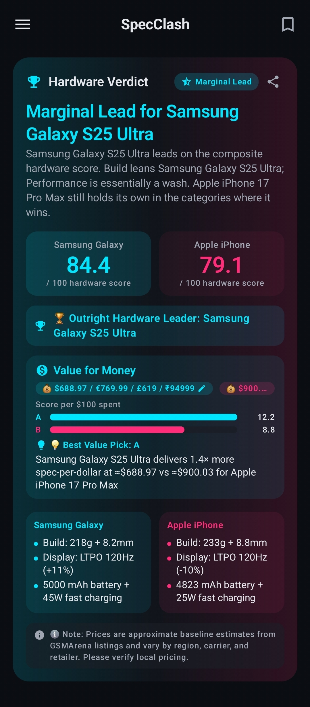
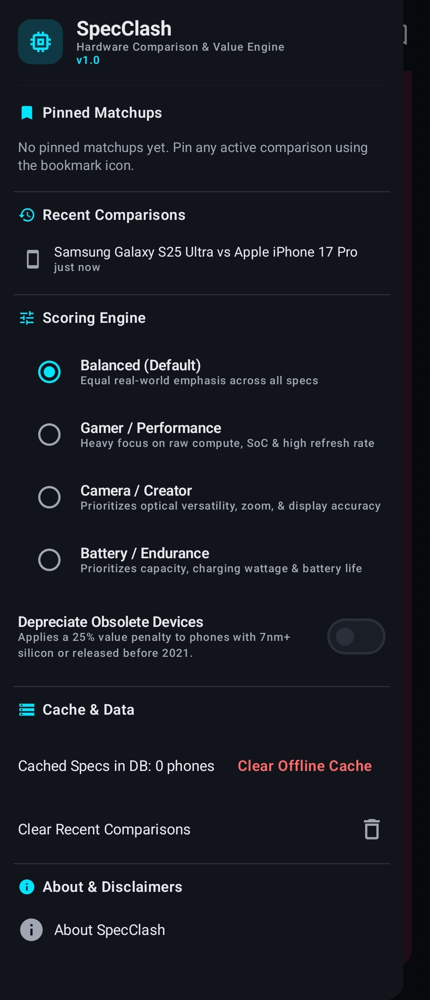

<div align="center">


# SpecClash

### Modern Jetpack Compose Smartphone Comparison &amp; Hardware Verdict Engine

[](https://kotlinlang.org)
[](https://developer.android.com/jetpack/compose)
[](https://m3.material.io)
[](#getting-started)
[](#getting-started)
[](#architecture--tech-stack)
[](LICENSE)

**SpecClash pits any two phones head-to-head and tells you, in plain numbers, which one actually wins.**
It pulls live spec sheets, renders them into a differences-aware side-by-side matrix, and feeds every
data point into a weighted composite hardware-scoring engine — so "better camera" becomes a real,
comparable number instead of a marketing sentence. Pair that with a value-for-money index (spec-per-dollar,
overridable with a real street price you paid) and a one-tap shareable verdict card, and you get a decisive
answer, not another spec-sheet wall of text.

</div>

---

## 📸 Screenshot Gallery

<table>
<tr>
<td align="center" width="50%">
<br/>
<b>Pick Two Devices</b><br/>
<sub>Clean empty state — tap either slot to search and load a phone's full spec sheet.</sub>
</td>
<td align="center" width="50%">
<br/>
<b>Side-by-Side Spec Matrix &amp; Differences Filter</b><br/>
<sub>Galaxy S25 Ultra vs. iPhone 17 Pro Max, with live price badges and a per-category differences filter.</sub>
</td>
</tr>
<tr>
<td align="center" width="50%">
<br/>
<b>Multi-Lens Camera Breakdown</b><br/>
<sub>Every rear sensor — wide, telephoto, periscope, ultrawide — bulleted and aligned lens-by-lens, no truncation.</sub>
</td>
<td align="center" width="50%">
<br/>
<b>Dynamic Hardware Verdict &amp; Value-for-Money</b><br/>
<sub>Composite 0–100 hardware score, per-category advantages, and a spec-per-dollar value comparison.</sub>
</td>
</tr>
<tr>
<td align="center" colspan="2">
<br/>
<b>Scoring Engine Presets &amp; Data Controls</b><br/>
<sub>Balanced, Gamer/Performance, Camera/Creator, and Battery/Endurance weighting profiles, plus cache management.</sub>
</td>
</tr>
</table>

> A few features don't have a dedicated screenshot above but are fully implemented and covered in
> [Core Features](#-core-features): the **Lab Benchmarks** panel (Geekbench 6, AnTuTu v10, 3DMark),
> **EU Label durability metrics** (battery longevity, drop resistance, repairability, energy class),
> the **manual price-override dialog**, and **shareable PNG verdict export**.

---

## ✨ Core Features

- **📊 Side-by-Side Dynamic Spec Matrix** — Every category (Display, Platform, Camera, Battery, Body, and more) renders as a live two-column comparison with automated delta badges computed per metric — `+34 W faster`, `30 g lighter`, `$47 lower`, `+0.4" larger` — always phrased from the winning device's perspective, whichever side it lands on.
- **🔍 Show Differences Only Mode** — A single toggle collapses every row where both devices match, using whitespace- and case-normalized comparison so cosmetic scrape formatting never produces a false "difference."
- **🏆 Composite Hardware Scoring Engine** — A weighted 0–100 score across five hardware categories (Display, Camera, Performance, Battery, Build), with four selectable presets — **Balanced**, **Gamer/Performance**, **Camera/Creator**, and **Battery/Endurance** — that re-weight the composite in real time.
- **💰 Value-for-Money Index** — Score-per-$100 calculated against live scraped market pricing, or a manually entered street price you actually paid, with an optional 25% "legacy silicon" depreciation penalty for older chipsets.
- **🔬 Lab Benchmarks &amp; EU Durability Integration** — Dedicated parsing for Geekbench 6, AnTuTu v10, and 3DMark scores out of the upstream benchmark blob, plus EU Energy Label metrics: battery cycle longevity, IP/drop (free-fall) resistance class, and repairability index.
- **🖼️ High-Resolution PNG Card Export** — The verdict card is captured straight off the Compose `GraphicsLayer` and shared as a PNG through the app's `FileProvider`, no screenshot workaround required.
- **🔎 Tokenized Relevance Search** — Multi-keyword token matching (`"samsung s25"` finds "Samsung Galaxy S25" even though "Galaxy" sits in between) with exact/prefix/substring scoring, a recency tiebreaker, and quick-pick brand chips.
- **📱 Multi-Lens Camera &amp; Selfie Rendering** — Rear "Single/Dual/Triple/Quad" camera keys are unified onto one `Rear Sensors` row regardless of lens count, with every sensor bulleted on its own line; the front camera gets its own dedicated section.
- **📌 Pinned Matchups &amp; Recent History** — Bookmark an active comparison or revisit recent ones, backed by local Room storage.

---

## 🏗️ Architecture &amp; Tech Stack

SpecClash follows **MVVM + Clean Architecture**: a single `HomeViewModel` exposes reactive `StateFlow`s
built from a repository that mediates between the network, an offline Room cache, and a pure-Kotlin domain
layer (`SpecComparator`, `SearchRanking`) that has zero Android/UI dependencies and is fully unit-testable
on the JVM.

| Layer | Technology |
|---|---|
| **UI** | 100% Jetpack Compose · Material 3 · Navigation Compose · Coil (image loading) · Adaptive icon with Android 13+ themed-icon (monochrome) support |
| **Presentation** | MVVM — `HomeViewModel` + Kotlin Coroutines + `StateFlow` |
| **Domain** | Plain Kotlin — `SpecComparator` (delta engine + weighted verdict scoring), `SearchRanking` (tokenized search) |
| **Networking** | Retrofit 2 + OkHttp + kotlinx.serialization, talking to a Cloudflare Worker proxy (`specclash-proxy`) that normalizes upstream spec data |
| **Local Storage** | Room (SQLite) — cached phone specs, comparison history, pinned matchups · `SharedPreferences` — scoring-engine preset &amp; legacy-depreciation toggle |
| **Graphics &amp; Sharing** | Compose `GraphicsLayer` capture → PNG → Android `FileProvider` share sheet |
| **Build** | Gradle Kotlin DSL · Android Gradle Plugin 9.1.1 · KSP2 (Room codegen) · Kotlin 2.2.20 |

<details>
<summary><b>Project structure</b></summary>

```
com.example.specclash/
├── data/
│   ├── local/           Room entities, DAOs & SpecClashDatabase (cached specs, history, pinned matchups)
│   ├── remote/          Retrofit API, DTOs, Cloudflare Worker proxy client
│   ├── preferences/      UserPreferencesRepository (SharedPreferences-backed)
│   └── SpecClashRepository.kt
├── domain/
│   ├── Models.kt          PhoneSpec, SearchDevice
│   ├── SpecComparator.kt  Delta engine + weighted multi-attribute scoring verdict engine
│   └── SearchRanking.kt   Tokenized multi-keyword search ranking
├── ui/
│   ├── home/              HomeScreen, HomeViewModel, spec matrix & verdict Composables
│   ├── search/            SearchDialog
│   ├── theme/              Color / Theme / Type
│   └── util/               ShareUtils (Compose-layer → PNG → FileProvider)
├── MainActivity.kt
└── SpecClashApplication.kt
```

</details>

---

## 🚀 Getting Started

### Prerequisites

- **Android Studio** Ladybug or newer (Meerkat+ recommended for AGP 9.x / KSP2)
- **JDK** 17 or 21
- **Android SDK** — compileSdk / targetSdk **37**, minSdk **26**
- An internet connection (spec data is fetched live through the Cloudflare Worker proxy)

### Clone

```bash
git clone https://github.com/EmirXK/SpecClash.git
cd SpecClash
```

### Run the unit test suite

```bash
./gradlew :app:test
```

### Assemble a debug APK

```bash
./gradlew :app:assembleDebug
```

### Install on a connected device or emulator

```bash
adb install -r app/build/outputs/apk/debug/app-debug.apk
```

---

## 🧪 Testing

The domain layer (`SpecComparator`, `SearchRanking`) and the spec-matrix builder are plain-Kotlin and
covered by JVM unit tests under `app/src/test` — no emulator required. Run them with:

```bash
./gradlew :app:test
```

---

## 📄 License

SpecClash is licensed under the [MIT License](LICENSE) © 2026 EmirXK.
